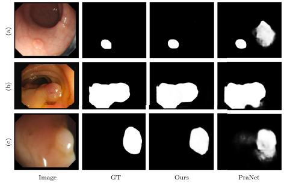

# Awesome-Polyp-Segmentation

Will collect polyp segmentastion models.

      

# 
`Awesome List for Polyp Segmentation`

This awesome list is under construction. If you have anything to recommend or any suggestions, please feel free to contact us via e-mail (taozhou.ai@gmail) or directly push a PR. 

< **Last updated: 15/04/2023** >

##  1. Content

- [`Awesome List for Polyp Segmentation`](#awesome-list-for-polyp-segmentation)
	- [1. Content](#1-content)
	- [2. Paper List](#2-paper-list)
		- [2.1. Datasets \& Benchmarks](#21-datasets--benchmarks)
			- [2.1.1. Image-level Polyp](#211-video-level-polyp)
			- [2.1.2. Video-level Polyp](#212-image-level-polyp)
		- [2.2. Polyp Segmentation](#22-polyp--segmentation) 
			- [2.2.1. YEAR 2023](#221-year-2023)
			- [2.2.2. YEAR 2022](#222-year-2022)
			- [2.2.3. YEAR 2021](#223-year-2021)
			- [2.2.4. Before YEAR 2020](#224-before-year-2020)
		- [2.3. Video Polyp Segmentation](#23-video-polyp-segmentation)
		

##  2. Paper List

###  2.1. Datasets & Benchmarks

####  2.1.1. Image-level polyp segmentation

| **Dataset Name** | **Year** | **Publication** | **Links** |
| :------: | :------: | :-------: | :---------|
[CVCClinicDB](https://xueliancheng.github.io/SLT-Net-project/) | 2015 | CMIG | [Paper](https://www.sciencedirect.com/science/article/pii/S0895611115000567) |
[CVC-ColonDB](https://xueliancheng.github.io/SLT-Net-project/) | 2015 | CMIG | [Paper](https://www.sciencedirect.com/science/article/pii/S0895611115000567) |
[Kvasir](https://xueliancheng.github.io/SLT-Net-project/) | 2015 | CMIG | [Paper](https://www.sciencedirect.com/science/article/pii/S0895611115000567) |

####  2.1.2. Video-level polyp segmentation

| **Dataset Name** | **Year** | **Publication** | **Links** |
| :------: | :------: | :-------: | :---------|
[CVCClinicDB](https://xueliancheng.github.io/SLT-Net-project/) | 2015 | CMIG | [Paper](https://www.sciencedirect.com/science/article/pii/S0895611115000567) |

###  2.2. Polyp Segmentation

####  2.2.1. YEAR 2023

| **Year** | **Model** | **Publication** | **Title**                                 |  **Links**                                                    |
| :------: | :------: |:------: | :----------------------------------------------------------- |  :----------------------------------------------------------- |
| 2023 | CFA-Net | PR | Cross-level Feature Aggregation Network for Polyp Segmentation  *Tao Zhou, Yi Zhou, Kelei He, Chen Gong, Jian Yang, Huazhu Fu, Dinggang Shen* | [Paper](https://www.sciencedirect.com/science/article/pii/S0031320323002558)/[Code](https://github.com/taozh2017/CFANet)/[Seg-Maps](https://github.com/taozh2017/CFANet)
	

####  2.2.2. YEAR 2022

| **Year** | **Model** | **Publication** | **Title**                                 |  **Links**                                                    |
| :------: | :------: |:------: | :----------------------------------------------------------- |  :----------------------------------------------------------- |
| 2022 | BSCA-Net | PR | BSCA-Net: Bit Slicing Context Attention Network for Polyp Segmentation  *Yi Lin, Jichun Wu, Guobao Xiao, Junwen Guo, Geng Chen, Jiayi Ma* | [Paper](https://guobaoxiao.github.io/papers/PR_2022_BSCA.pdf)/Code/Seg-Maps	
	

####  2.2.3. YEAR 2021

| **Year** | **Model** | **Publication** | **Title**                                 |  **Links**                                                    |
| :------: | :------: |:------: | :----------------------------------------------------------- |  :----------------------------------------------------------- |
| 2021 | MSNet | MICCAI | Automatic Polyp Segmentation via Multi-scale Subtraction Network  *Xiaoqi Zhao, Lihe Zhang, Huchuan Lu * | [Paper](https://link.springer.com/chapter/10.1007/978-3-030-87193-2_12)/[Code](https://github.com/Xiaoqi-Zhao-DLUT/MSNet-M2SNet)/Seg-Maps	

####  2.2.4. Before YEAR 2020 

| **Year** | **Model** | **Publication** | **Title**                                 |  **Links**                                                    |
| :------: | :------: |:------: | :----------------------------------------------------------- |  :----------------------------------------------------------- |
| 2022 | PraNet | MICCAI | PraNet: Parallel Reverse Attention Network for Polyp Segmentation  *Deng-Ping Fan, Ge-Peng Ji, Tao Zhou, Geng Chen, Huazhu Fu*, Jianbing Shen*, Ling Shao* | [Paper](https://link.springer.com/chapter/10.1007/978-3-030-59725-2_26)/[Code](https://github.com/DengPingFan/PraNet)/Seg-Maps	    

###  2.3. Video Polyp Segmentation

| **Year** | **Model** | **Publication** | **Title**                                 |  **Links**                                                    |
| :------: | :------: |:------: | :----------------------------------------------------------- |  :----------------------------------------------------------- |
| 2022 | PraNet | MICCAI | PraNet: Parallel Reverse Attention Network for Polyp Segmentation  *Deng-Ping Fan, Ge-Peng Ji, Tao Zhou, Geng Chen, Huazhu Fu*, Jianbing Shen*, Ling Shao* | [Paper](https://link.springer.com/chapter/10.1007/978-3-030-59725-2_26)/[Code](https://github.com/DengPingFan/PraNet)	

