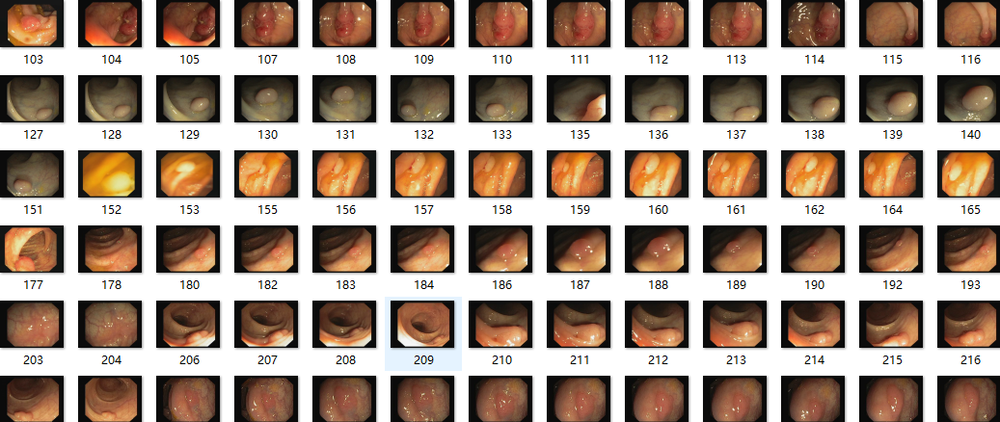

# Awesome-Polyp-Segmentation

Will collect polyp segmentastion models.

      

# 
`Awesome List for Polyp Segmentation`

This awesome list is under construction. If you have anything to recommend or any suggestions, please feel free to contact us via e-mail (taozhou.ai@gmail) or directly push a PR. 

< **Last updated: 23/04/2023** >

##  1. Content

- [`Awesome List for Polyp Segmentation`](#awesome-list-for-polyp-segmentation)
	- [1. Content](#1-content)
	- [2. Paper List](#2-paper-list)
		- [2.1. Datasets \& Benchmarks](#21-datasets--benchmarks)
			- [2.1.1. Image-level Polyp](#211-video-level-polyp)
			- [2.1.2. Video-level Polyp](#212-image-level-polyp)
		- [2.2. Fully-supervised Polyp Segmentation](#22-polyp--segmentation) 
			- [2.2.1. YEAR 2023](#221-year-2023)
			- [2.2.2. YEAR 2022](#222-year-2022)
			- [2.2.3. YEAR 2021](#223-year-2021)
			- [2.2.4. Before YEAR 2020](#224-before-year-2020)
     
		- [2.3. Semi-/Weakly-supervised Polyp Segmentation](#23-semi-polyp--segmentation)
  
			- [2.3.1. Semi-supervised](#231-Semi-supervised)
			- [2.3.2. Weakly-supervised](#232-Weakly-supervised)

    
		- [2.4. Video Polyp Segmentation](#24-video-polyp-segmentation)
		

##  2. Paper List

###  2.1. Datasets & Benchmarks

####  2.1.1. Image-level polyp segmentation

| **Dataset Name** | **Year** | **Publication** | **Links** |
| :------: | :------: | :-------: | :---------|
[ETIS-LaribPolypDB](https://link.springer.com/article/10.1007/s11548-013-0926-3) | 2014 | IJCARS | [Paper](https://link.springer.com/article/10.1007/s11548-013-0926-3) |
[CVC-ColonDB](https://xueliancheng.github.io/SLT-Net-project/) | 2015 | PR | [Paper](https://link.springer.com/article/10.1007/s11548-013-0926-3) |
[CVC-ClinicDB](https://polyp.grand-challenge.org/CVCClinicDB/) | 2015 | CMIG | [Paper](https://www.sciencedirect.com/science/article/pii/S0895611115000567) |
[Kvasir](https://datasets.simula.no/kvasir/) | 2017 | ACM | [Paper](https://dl.acm.org/doi/abs/10.1145/3083187.3083212) |
[CVC-300](https://github.com/jbernoz/deeppolyp) | 2017 |JHE | [Paper](https://www.hindawi.com/journals/jhe/2017/4037190/)|
[CVC-EndoSceneStill](https://pages.cvc.uab.es/CVC-Colon/index.php/databases/cvc-endoscenestill/)| 2017 |JHE | [Paper](https://www.hindawi.com/journals/jhe/2017/4037190/)|
[Kvasir-SEG](https://datasets.simula.no/kvasir-seg/)| 2020 | MMM | [Paper](https://link.springer.com/chapter/10.1007/978-3-030-37734-2_37)|
[PICCOLO](https://www.biobancovasco.bioef.eus/en/Sample-and-data-catalog/Databases/PD178-PICCOLO-EN.html)| 2020 | AS | [Paper](https://www.mdpi.com/2076-3417/10/23/8501)|
[PolypGen](https://github.com/sharib-vision/PolypGen-Benchmark) | 2021 | SCI DATA | [Paper](https://arxiv.org/abs/2106.04463) |

####  2.1.2. Video-level polyp segmentation

| **Dataset Name** | **Year** | **Publication** | **Links** |
| :------: | :------: | :-------: | :---------|
[ASU-Mayo Clinic Colonoscopy Video](https://polyp.grand-challenge.org/AsuMayo/) | 2016 | TMI | [Paper](https://ieeexplore.ieee.org/abstract/document/7294676)
[CVC-ClinicVideoDB](https://endovissub2017-giana.grand-challenge.org/) | 2017 | CMIG | [Paper](https://www.sciencedirect.com/science/article/pii/S0895611115000567) |
[LDPolypVideo](https://github.com/dashishi/LDPolypVideo-Benchmark) | 2021 | MICCAI | [Paper](https://link.springer.com/chapter/10.1007/978-3-030-87240-3_37) 
[Kvasir-capsule](https://github.com/simula/kvasir-capsule)|2021| Sci Data |[Paper](https://www.nature.com/articles/s41597-021-00920-z)
[SUN-SEG](https://github.com/GewelsJI/VPS)| 2022 | MIR | [Paper](https://link.springer.com/article/10.1007/s11633-022-1371-y)|

###  2.2. Polyp Segmentation

####  2.2.1. YEAR 2023

| **Year** | **Model** | **Publication** | **Title**                                 |  **Links**                                                    |
| :------: | :------: |:------: | :----------------------------------------------------------- |  :----------------------------------------------------------- |
| 2023 | MMFIL-Net | Displays | MMFIL-Net: Multi-level and multi-source feature interactive lightweight network for polyp segmentation  Zaka-Ud-Din Muhammad, Usman Muhammad, Zhangjin Huang, Naijie Gu  | [Paper](https://www.sciencedirect.com/science/article/pii/S0141938223002342)/Code
| 2023 | BUNet | Neural Networks | Boundary uncertainty aware network for automated polyp segmentation  Guanghui Yue, Guibin Zhuo , Weiqing Yan, Tianwei Zhou, Chang Tang, Peng Yang, Tianfu Wang  | [Paper](https://www.sciencedirect.com/science/article/pii/S0893608023006731)/Code
| 2023 | CoAM-Net |  Applied Intelligence  | CoAM-Net: coordinate asymmetric multi-scale fusion strategy for polyp segmentation  Yuanyuan Wang, Weimin Yuan & Xiangzhi Bai  | [Paper](https://link.springer.com/article/10.1007/s10489-023-05135-w)/[Code](https://github.com/wangyuanyuan0/CoAM-Net)
| 2023 | CSwinDoubleU-Net |  BSPC  | CSwinDoubleU-Net: A double U-shaped network combined with convolution and Swin Transformer for colorectal polyp segmentation  Yuanjie Lin, Xiaoxiang Han, Keyan Chen, Weikun Zhang, Qiaohong Liu  | [Paper](https://www.sciencedirect.com/science/article/pii/S1746809423011825)/Code
| 2023 | DAMFormer |  ICONIP  | DAMFormer: Enhancing Polyp Segmentation Through Dual Attention Mechanism  Huy Trinh Quang, Mai Nguyen, Quan Nguyen Van, Linh Doan Bao, Thanh Dang Hong, Thanh Nguyen Tung & Toan Pham Van   | [Paper](https://link.springer.com/chapter/10.1007/978-981-99-8070-3_8)/Code
| 2023 | META-Unet | IEEE TASE | META-Unet: Multi-Scale Efficient Transformer Attention Unet for Fast and High-Accuracy Polyp Segmentation  Huisi Wu; Zebin Zhao; Zhaoze Wang   | [Paper](https://ieeexplore.ieee.org/abstract/document/10179485)/[Code](https://github.com/szuzzb/META-Unet)
| 2023 | CFA-Net | PR | Cross-level Feature Aggregation Network for Polyp Segmentation  *Tao Zhou, Yi Zhou, Kelei He, Chen Gong, Jian Yang, Huazhu Fu, Dinggang Shen* | [Paper](https://www.sciencedirect.com/science/article/pii/S0031320323002558)/[Code](https://github.com/taozh2017/CFANet)
| 2023 | CASCADE | WACV | Medical Image Segmentation via Cascaded Attention Decoding  *Md Mostafijur Rahman, Radu Marculescu* | [Paper](https://openaccess.thecvf.com/content/WACV2023/papers/Rahman_Medical_Image_Segmentation_via_Cascaded_Attention_Decoding_WACV_2023_paper.pdf)/[Code](https://github.com/SLDGroup/CASCADE)
| 2023 | TransNetR | MIDL | TransNetR: Transformer-based Residual Network for Polyp Segmentation with Multi-Center Out-of-Distribution Testing  *Debesh Jha, Nikhil Kumar Tomar, Vanshali Sharma, Ulas Bagci* | [Paper](https://arxiv.org/pdf/2303.07428.pdf)/[Code](https://github.com/DebeshJha/TransNetR)
| 2023 | ESFPNet | Medical Imaging 2023: Biomedical Applications in Molecular, Structural, and Functional Imaging | ESFPNet: efficient deep learning architecture for real-time lesion segmentation in autofluorescence bronchoscopic video  *Qi Chang, Danish Ahmad, Jennifer Toth, Rebecca Bascom, William E. Higgins* | [Paper](https://arxiv.org/pdf/2207.07759v3.pdf)/[Code](https://github.com/dumyCq/ESFPNet)
| 2023 | FCB-SwinV2 Transformer | Arxiv | FCB-SwinV2 Transformer for Polyp Segmentation  *Kerr Fitzgerald, Bogdan Matuszewski* | [Paper](https://arxiv.org/ftp/arxiv/papers/2302/2302.01027.pdf)/Code
| 2023 | Polyp-SAM | Arxiv | Polyp-SAM: Transfer SAM for Polyp Segmentation  *Yuheng Li, Mingzhe Hu, Xiaofeng Yang* | [Paper](https://arxiv.org/ftp/arxiv/papers/2305/2305.00293.pdf)/[Code](https://github.com/ricklisz/Polyp-SAM)
| 2023 | LAPFormer | Arxiv | LAPFormer: A Light and Accurate Polyp Segmentation Transformer  *Mai Nguyen, Tung Thanh Bui, Quan Van Nguyen, Thanh Tung Nguyen, Toan Van Pham * | [Paper](https://arxiv.org/pdf/2210.04393.pdf)/Code
| 2023 | Fu-TransHNet | Arxiv | Cooperation Learning Enhanced Colonic Polyp Segmentation Based on TransformerCNN Fusion  *Yuanyuan Wang, Zhaohong Deng,Qiongdan Lou, Shudong Hu, Kup-sze Choi, Shitong Wang* | [Paper](https://arxiv.org/ftp/arxiv/papers/2301/2301.06892.pdf)/Code
| 2023 | PEFNet | MMM | PEFNet: Positional Embedding Feature for Polyp Segmentation  *Trong-Hieu Nguyen-Mau, Quoc-Huy Trinh, Nhat-Tan Bui, Phuoc-Thao Vo Thi, Minh-Van Nguyen, Xuan-Nam Cao, Minh-Triet Tran, Hai-Dang Nguyen* | [Paper](https://link.springer.com/chapter/10.1007/978-3-031-27818-1_20)/[Code](https://github.com/huyquoctrinh/PEFNet)
| 2023 | APCNet | TIM | Attention-Guided Pyramid Context Network for Polyp Segmentation in Colonoscopy Images  *Guanghui Yue,Siying Li, Runmin Cong, Tianwei Zhou, Baiying Lei, Tianfu Wang* | [Paper](https://ieeexplore.ieee.org/stamp/stamp.jsp?tp=&arnumber=10058111)/Code	
| 2023 | unnamed | Neurocomputingg | Accurate polyp segmentation through enhancing feature fusion and boosting boundary performanc  *Yanzhou Su, Jian Cheng, Chuqiao Zhong, Chengzhi Jiang, Jin Ye, Junjun He* | [Paper](https://reader.elsevier.com/reader/sd/pii/S0925231223003569?token=F7DD07A4BF4F480A1648EDD7327A1017DB7A5EACFBC742BF6B5B818415DF03C6E728C206A00EE7DACB3A262AFFD64853&originRegion=us-east-1&originCreation=20230518081533)/Code	
| 2023 | FeDNet | BSPC | FeDNet: Feature Decoupled Network for polyp segmentation from endoscopy images  *Yanzhou Su, Jian Cheng, Chuqiao Zhong, Yijie Zhang, Jin Ye, Junjun He, Jun Liu* | [Paper](https://reader.elsevier.com/reader/sd/pii/S1746809423001325?token=25CD9CF39B28CC9B719AF67D3062E10EC3506DF3729CD04CAEF1A1151460230718E494A23CF73D0B6D471A5B91C74A4A&originRegion=us-east-1&originCreation=20230518075548)/[Code](https://github.com/suyanzhou626/FeDNet-BSPC)
| 2023 | HarDNet-CPS | BSPC | HarDNet-CPS: Colorectal polyp segmentation based on Harmonic Densely United Network  *Tong Yu, Qingxiang Wu* | [Paper](https://reader.elsevier.com/reader/sd/pii/S1746809423003865?token=6CFD7F61390B2E906B13547EC3481F8E23AAEC9B9A42F4DFB5D64EC4E1726C92368749A92842F1A46E66DEC8D391A5F0&originRegion=us-east-1&originCreation=20230518085852)/Code
| 2023 | RA-DENet | CompBioMed | RA-DENet: Reverse Attention and Distractions Elimination Network for polyp segmentation  *Kaiqi Wang, Li Liu, Xiaodong Fu, Lijun Liu, Wei Peng* | [Paper](https://reader.elsevier.com/reader/sd/pii/S0010482523001695?token=FA58C819DA9C8F813C619868240E3E427BF2589832FFA0EB5A358959C9CC0B8081EE8BC5A16ED471FAC905FBF7C1E268&originRegion=us-east-1&originCreation=20230518075548)/Code
| 2023 | PPNet | CompBioMed | PPNet: Pyramid pooling based network for polyp segmentation  *Keli Hu, Wenping Chen, YuanZe Sun, Xiaozhao Hu, Qianwei Zhou, Zirui Zheng* | [Paper](https://reader.elsevier.com/reader/sd/pii/S0010482523004936?token=2D12EE7774D5E3F4331D1B1B6F5DEC31BF6172F0A25C486A3DEFDC59270960EACB0CB5E49736971C8E3912C64BC2101A&originRegion=us-east-1&originCreation=20230518084005)/Code
| 2023 | EMTS-Net | JBHI | An Efficient Multi-Task Synergetic Network for Polyp Segmentation and Classification  *Miao Wang, Xingwei An, Zhengcun Pei, Ning Li, Li Zhang, Gang Liu and Dong Ming* | [Paper](https://ieeexplore.ieee.org/stamp/stamp.jsp?tp=&arnumber=10120931)/Code
| 2023 | unnamed | ICASSP | Semantic Memory Guided Image Representation for Polyp Segmentation  *Zijin Yin, Runpu Wei, Kongming Liang , Yiyang Lin, Wei Liu, Zhanyu Ma, Min Min, Jun Guo* | [Paper](https://ieeexplore.ieee.org/stamp/stamp.jsp?tp=&arnumber=10094302)/Code
| 2023 | DilatedSegNet | MMM | DilatedSegNet: A Deep Dilated Segmentation Network for Polyp Segmentation  *Nikhil Kumar Tomar, Debesh Jha, Ulas Bagci* | [Paper](https://link.springer.com/chapter/10.1007/978-3-031-27077-2_26)/[Code](https://github.com/nikhilroxtomar/DilatedSegNet)
| 2023 | CAFE-Net | Expert Syst. Appl. | CAFE-Net: Cross-Attention and Feature Exploration Network for polyp segmentation  Guoqi Liu, Sheng Yao, Dong Liu, Baofang Chang , Zongyu Chen, Jiajia Wang, Jiangqi Wei | [Paper](https://www.sciencedirect.com/science/article/abs/pii/S095741742302256X)/Code
| 2023 | MMS-Net | Eng Appl Artif Intell | Simple and robust depth-wise cascaded network for polyp segmentation  Tariq M. Khan, Muhammad Arsalan, Imran Razzak, Erik Meijering | [Paper](https://www.sciencedirect.com/science/article/pii/S0952197623002075)/Code
| 2023 | CRCNet | Biomed Signal Process Contro | CRCNet: Global-local context and multi-modality cross attention for polyp segmentation  Jianbo Zhu, Mingfeng Ge, Zhimin Chang, Wenfei Dong | [Paper](https://www.sciencedirect.com/science/article/abs/pii/S1746809423000265)/Code
| 2023 | CoInNet | IEEE TMI | CoInNet: A Convolution-Involution Network with a Novel Statistical Attention for Automatic Polyp Segmentation  Samir Jain; Rohan Atale; Anubhav Gupta; Utkarsh Mishra; Ayan Seal; Aparajita Ojha; Joanna Kuncewicz; Ondrej Krejcar | [Paper](https://ieeexplore.ieee.org/abstract/document/10266385)/Code
| 2023 | PSNet | SR | Dual encoder–decoder-based deep polyp segmentation network for colonoscopy images  John Lewis, Young-Jin Cha,Jongho Kim | [Paper](https://www.nature.com/articles/s41598-023-28530-2)/Code
| 2023 | RT-Net | NPL | RT-Net: Region-Enhanced Attention Transformer Network for Polyp Segmentation  Yilin Qin,Haiying Xia,Shuxiang Song  | [Paper](https://link.springer.com/article/10.1007/s11063-023-11405-y)/Code
| 2023 | BLE-Net | ACM MM | BLE-Net: boundary learning and enhancement network for polyp segmentation  Na Ta, Haipeng Chen, Yingda Lyu & Taosuo Wu   | [Paper](https://link.springer.com/article/10.1007/s00530-022-00900-2#citeas)/Code

	
####  2.2.2. YEAR 2022

| **Year** | **Model** | **Publication** | **Title**                                 |  **Links**                                                    |
| :------: | :------: |:------: | :----------------------------------------------------------- |  :----------------------------------------------------------- |
| 2022 | BSCA-Net | PR | BSCA-Net: Bit Slicing Context Attention Network for Polyp Segmentation  *Yi Lin, Jichun Wu, Guobao Xiao, Junwen Guo, Geng Chen, Jiayi Ma* | [Paper](https://guobaoxiao.github.io/papers/PR_2022_BSCA.pdf)/Code	
| 2022 | TRFRNet(UDA) | MICCAI | Task-Relevant Feature Replenishment for Cross-Centre Polyp Segmentation  *Yutian Shen, Ye Lu, Xiao Jia, Fan Bai, Max Q.-H. Meng* | [Paper](https://link.springer.com/10.1007/978-3-031-16440-8_57)/[Code](https://github.com/CathyS1996/TRFRNet)	
| 2022 | TGANet| MICCAI | TGANet: Text-guided attention for improved polyp segmentation  *Nikhil Kumar Tomar, Debesh Jha, Ulas Bagci, Sharib Ali* | [Paper](https://arxiv.org/pdf/2205.04280v1.pdf)/[Code](https://github.com/nikhilroxtomar/tganet)
| 2022 | LDNet | MICCAI | Lesion-Aware Dynamic Kernel for Polyp Segmentation  *Ruifei Zhang, Peiwen Lai, Xiang Wan, De-Jun Fan, Feng Gao, Xiao-Jian Wu, Guanbin Li* | [Paper](https://link.springer.com/chapter/10.1007/978-3-031-16437-8_10)/[Code](https://github.com/ReaFly/LDNet)
| 2022 | SSFormer | MICCAI | Stepwise Feature Fusion: Local Guides Global  *Jinfeng Wang, Qiming Huang, Feilong Tang, Jia Meng, Jionglong Su, Sifan Song* | [Paper](https://doi.org/10.1007/978-3-031-16437-8_11)/[Code](https://github.com/Qiming-Huang/ssformer)
| 2022 | BoxPolyp | MICCAI | BoxPolyp: Boost Generalized Polyp Segmentation Using Extra Coarse Bounding Box Annotations  *Jun Wei, Yiwen Hu, Guanbin Li, Shuguang Cui, S. Kevin Zhou, Zhen Li* | [Paper](https://link.springer.com/chapter/10.1007/978-3-031-16437-8_7)/Code
| 2022 | PPFormer | MICCAI | Using Guided Self-Attention with Local Information for Polyp Segmentation  *Linghan Cai, Meijing Wu, Lijiang Chen, Wenpei Bai, Min Yang, Shuchang Lyu, Qi Zhao * | [Paper](https://link.springer.com/chapter/10.1007/978-3-031-16440-8_60)/Code
| 2022 | MSRF-Net | JBHI | MSRF-Net: A Multi-Scale Residual Fusion Network for Biomedical Image Segmentation  *Abhishek Srivastava, Debesh Jha, Sukalpa Chanda, Umapada Pal, Håvard D. Johansen, Dag Johansen, Michael A. Riegler, Sharib Ali, Pål Halvorsen* | [Paper](https://arxiv.org/pdf/2105.07451v2.pdf)/[Code](https://github.com/NoviceMAn-prog/MSRF-Net)
| 2022 | BCNet | JBHI | Boundary Constraint Network With Cross Layer Feature Integration for Polyp Segmentation  *Guanghui Yue, Wanwan Han, Bin Jiang, Tianwei Zhou, Runmin Cong, Tianfu Wang* | [Paper](https://ieeexplore.ieee.org/stamp/stamp.jsp?tp=&arnumber=9772424)/Code
| 2022 | DCRNet | ISBI | Duplex contextual relation network for polyp segmentation  *Zijin Yin, Kongming Liang, Zhanyu Ma, Jun Guo* | [Paper](https://ieeexplore.ieee.org/stamp/stamp.jsp?tp=&arnumber=9761402)/[Code](https://github.com/PRIS-CV/DCRNet)
| 2022 | FCBFormer | MIUA | FCN-Transformer Feature Fusion for Polyp Segmentation  *Edward Sanderson, Bogdan J. Matuszewski* | [Paper](https://arxiv.org/pdf/2208.08352v1.pdf)/[Code](https://github.com/ESandML/FCBFormer)
| 2022 | ColonFormer | Access | ColonFormer: An Efficient Transformer based Method for Colon Polyp Segmentation  *Nguyen Thanh Duc, Nguyen Thi Oanh, Nguyen Thi Thuy, Tran Minh Triet, Dinh Viet Sang* | [Paper](https://arxiv.org/pdf/2205.08473v3.pdf)/[Code](https://github.com/ducnt9907/ColonFormer)
| 2022 | BDG-Net | Medical Imaging 2022: Image Processing | BDG-Net: Boundary Distribution Guided Network for Accurate Polyp Segmentation  *Zihuan Qiu, Zhichuan Wang, Miaomiao Zhang, Ziyong Xu, Jie Fan, Linfeng Xu* | [Paper](https://arxiv.org/pdf/2201.00767v2.pdf)/[Code](https://github.com/zihuanqiu/BDG-Net)
| 2022 | HarDNet-DFUS | Arxiv | HarDNet-DFUS: An Enhanced Harmonically-Connected Network for Diabetic Foot Ulcer Image Segmentation and Colonoscopy Polyp Segmentation  *Ting-Yu Liao, Ching-Hui Yang, Yu-Wen Lo, Kuan-Ying Lai, Po-Huai Shen, Youn-Long Lin* | [Paper](https://arxiv.org/pdf/2209.07313v1.pdf)/[Code](https://github.com/yuwenlo/hardnet-dfus)
| 2022 | DuAT | Arxiv | DuAT: Dual-Aggregation Transformer Network for Medical Image Segmentation  *Feilong Tang, Qiming Huang, Jinfeng Wang, Xianxu Hou, Jionglong Su, Jingxin Liu* | [Paper](https://arxiv.org/pdf/2212.11677v1.pdf)/[Code](https://github.com/Barrett-python/DuAT)
| 2022 | SEP | Arxiv | Spatially Exclusive Pasting: A General Data Augmentation for the Polyp Segmentation  *Lei Zhou* | [Paper](https://arxiv.org/pdf/2211.08284v3.pdf)/Code
| 2022 | TC-Net | BIBM | Temporal Correlation Network for Video Polyp Segmentation  *Ziheng Xu, Dehui Qiu, Senlin Lin, Xinyue Zhang, Sheng Shi, Shengtao Zhu, Fa Zhang, Xiaohua Wan* | [Paper](https://ieeexplore.ieee.org/stamp/stamp.jsp?tp=&arnumber=9995646)/Code
| 2022 | TransMixer | BIBM | TransMixer: A Hybrid Transformer and CNN Architecture for Polyp Segmentation  *Yanglin Huang, Donghui Tan, Yuan Zhang, Xuanya Li, Kai Hu* | [Paper](https://ieeexplore.ieee.org/stamp/stamp.jsp?tp=&arnumber=9995247)/Code
| 2022 | ICBNet | BIBM | ICBNet: Iterative Context-Boundary Feedback Network for Polyp Segmentation  *Yefan Xiao, Zhihao Chen, Liang Wan, Lequan Yu, Lei Zhu* | [Paper](https://ieeexplore.ieee.org/stamp/stamp.jsp?tp=&arnumber=9995022)/Code
| 2022 | CLD-Net | BIBM | CLD-Net: Complement Local Detail For Medical Small-Object Segmentation  *Rui Chen, Xiangfeng Wang, Bo Jin, Jiaqi Tu, Fengping Zhu, Yuxin Li* | [Paper](https://ieeexplore.ieee.org/stamp/stamp.jsp?tp=&arnumber=9995217)/Code
| 2022 | TASNet | BIBM | Single-Modality Endoscopic Polyp Segmentation via Random Color Reversal Synthesis and Two-Branched Learning  *Mingzhu Chen, Xiaotong Li, Jilan Xu, Runtian Yuan, Yuejie Zhang, Rui Feng, Tao Zhang, Shang Gao* | [Paper](https://ieeexplore.ieee.org/stamp/stamp.jsp?tp=&arnumber=9995402)/Code
| 2022 | unnamed | PRCV | Boundary-Aware Polyp Segmentation Network  *Lu Lu, Xitong Zhou, Shuhan Chen, Zuyu Chen, Jinhao Yu, Haonan Tang, Xuelong Hu* | [Paper](https://link.springer.com/chapter/10.1007/978-3-031-18916-6_6)/Code
| 2022 | FuzzyNet | NeurIPS  Workshop | FuzzyNet: A Fuzzy Attention Module for Polyp Segmentation  *Krushi Patel, Fenjun Li, Guanghui Wang* | [Paper](https://openreview.net/pdf?id=bDa_0vVujZ)/[Code](https://github.com/krushi1992/FuzzyNet)
| 2022 | SwinPA-Net | TNNLS | SwinPA-Net: Swin Transformer-Based Multiscale Feature Pyramid Aggregation Network for Medical Image Segmentation  *Hao Du, Jiazheng Wang, Min Liu, Yaonan Wang, Erik Meijering* | [Paper](https://ieeexplore.ieee.org/stamp/stamp.jsp?tp=&arnumber=9895210)/Code
| 2022 | HSNet | CompBioMed | HSNet: A hybrid semantic network for polyp segmentation  *Wenchao Zhang, Chong Fu, Yu Zheng, Fangyuan Zhang, Yanli Zhao, Chiu-Wing Sham* | [Paper](https://reader.elsevier.com/reader/sd/pii/S0010482522008812?token=EE7BA1875E01966A91E578639EFD828DDF0DC70EB31040C21B84577ACCE553691F6A00C24E0031488E2F0D28C583ECE0&originRegion=us-east-1&originCreation=20230518091751)/[Code](https://github.com/baiboat/HSNet)
| 2022 | MSRAformer | CompBioMed | MSRAformer: Multiscale spatial reverse attention network for polyp segmentation  *Cong Wu, Cheng Long, Shijun Li, Junjie Yang, Fagang Jiang, Ran Zhou* | [Paper](https://reader.elsevier.com/reader/sd/pii/S0010482522009829?token=A592C64A25DCBB2D9EF047355807B6E491D19B8D4788C1F7EE939FD430DF3933A14CA70EA670E52F24B87E33D3FDACDA&originRegion=us-east-1&originCreation=20230518090647)/[Code](https://github.com/ChengLong1222/MSRAformer-main)
| 2022 | SwinE-Net | JCR | SwinE-Net: hybrid deep learning approach to novel polyp segmentation using convolutional neural network and Swin Transformer  Kyeong-Beom Park, Jae Yeol Lee | [Paper](https://academic.oup.com/jcde/article/9/2/616/6564811?login=false)/Code
| 2022 | AMNet | CBM | Attention based multi-scale parallel network for polyp segmentation Pengfei Song, Jinjiang Li, Hui Fan | [Paper](https://www.sciencedirect.com/science/article/pii/S0010482522002682)/Code
| 2022 | PolypSeg+ | IEEE TC | PolypSeg+: A Lightweight Context-Aware Network for Real-Time Polyp Segmentation Huisi Wu; Zebin Zhao; Jiafu Zhong; Wei Wang; Zhenkun Wen; Jing Qin | [Paper](https://ieeexplore.ieee.org/abstract/document/9756512)/[Code](https://github.com/szuzzb/polypsegplus)
| 2022 | DBMF | CBM | DBMF: Dual Branch Multiscale Feature Fusion Network for polyp segmentation Fangjin Liu, Zhen Hua, Jinjiang Li, Linwei Fan | [Paper](https://www.sciencedirect.com/science/article/pii/S0010482522010125)/Code
| 2022 | ACENet | CBM | Adaptive Context Exploration Network for Polyp Segmentation in Colonoscopy Images Guanghui Yue, Siying Li, Tianwei Zhou, Miaohui Wang,Jingfeng Du,Qiuping Jiang,Wei Gao,Tianfu Wang,Jun Lv | [Paper](https://ieeexplore.ieee.org/abstract/document/9852746)/Code
| 2022 | MIA-Net | KBS | MIA-Net: Multi-information aggregation network combining transformers and convolutional feature learning for polyp segmentation Weisheng Li, Yinghui Zhao, Feiyan Li, Linhong Wang | [Paper](https://www.sciencedirect.com/science/article/pii/S0950705122003926)/Code	
| 2022 | FAPN | BSPC | FAPN: Feature Augmented Pyramid Network for polyp segmentation Yanzhou Su, Jian Cheng, Murong Yi, Haijun Liu | [Paper](https://www.sciencedirect.com/science/article/pii/S1746809422004074)/Code	

####  2.2.3. YEAR 2021

| **Year** | **Model** | **Publication** | **Title**                                 |  **Links**                                                    |
| :------: | :------: |:------: | :----------------------------------------------------------- |  :----------------------------------------------------------- |
| 2021 | MSNet | MICCAI | Automatic Polyp Segmentation via Multi-scale Subtraction Network  *Xiaoqi Zhao, Lihe Zhang, Huchuan Lu* | [Paper](https://link.springer.com/chapter/10.1007/978-3-030-87193-2_12)/[Code](https://github.com/Xiaoqi-Zhao-DLUT/MSNet-M2SNet)	
| 2021 | CCBANet | MICCAI | CCBANet: Cascading Context and Balancing Attention for Polyp Segmentation  *Tan-Cong Nguyen, Tien-Phat Nguyen, Gia-Han Diep, Anh-Huy Tran-Dinh, Tam V. Nguyen, Minh-Triet Tran* | [Paper](https://link.springer.com/chapter/10.1007/978-3-030-87193-2_60)/[Code](https://github.com/ntcongvn/CCBANet)	
| 2021 | HRENet | MICCAI | HRENet: A Hard Region Enhancement Network for Polyp Segmentation  *Yutian Shen, Xiao Jia, Max Q.-H. Meng | [Paper](https://link.springer.com/chapter/10.1007/978-3-030-87193-2_53)/[Code](https://github.com/CathySH/HRENet)	
| 2021 | LOD-Net | MICCAI | Learnable Oriented-Derivative Network for Polyp Segmentation  *Mengjun Cheng, Zishang Kong, Guoli Song, Yonghong Tian, Yongsheng Liang, Jie Chen* | [Paper](https://link.springer.com/chapter/10.1007/978-3-030-87193-2_68)/[Code](https://github.com/midsdsy/LOD-Net)	
| 2021 | STFT | MICCAI | Multi-frame Collaboration for Effective Endoscopic Video Polyp Detection via Spatial-Temporal Feature Transformation  *Lingyun Wu, Zhiqiang Hu, Yuanfeng Ji, Ping Luo, Shaoting Zhang* | [Paper](https://link.springer.com/chapter/10.1007/978-3-030-87240-3_29)/[Code](https://github.com/lingyunwu14/STFT)	
| 2021 | SANet | MICCAI | Shallow Attention Network for Polyp Segmentation  *Jun Wei, Yiwen Hu, Ruimao Zhang, Zhen Li, S. Kevin Zhou, Shuguang Cui* | [Paper](https://link.springer.com/chapter/10.1007/978-3-030-87193-2_66)/[Code](https://github.com/weijun88/sanet)
| 2021 | TransFuse | MICCAI | TransFuse: Fusing Transformers and CNNs for Medical Image Segmentation  *Yundong Zhang, Huiye Liu, Qiang Hu* | [Paper](https://link.springer.com/chapter/10.1007/978-3-030-87193-2_2)/[Code](https://github.com/Rayicer/TransFuse)	
| 2021 | MPA-DA(UDA) | JBHI | Mutual-Prototype Adaptation for Cross-Domain Polyp Segmentation  *Chen Yang, Xiaoqing Guo, Meilu Zhu, Bulat Ibragimov, Yixuan Yuan* | [Paper](https://ieeexplore.ieee.org/document/9423517/)/[Code](https://github.com/CityU-AIM-Group/MPA-DA)
| 2021 | ResUNet++ + TTA + CRF | JBHI | A Comprehensive Study on Colorectal Polyp Segmentation with ResUNet++, Conditional Random Field and Test-Time Augmentation  *Debesh Jha, Pia H. Smedsrud, Dag Johansen, Thomas de Lange, Havard D. Johansen, Pal Halvorsen, and Michael A. Riegler* | [Paper](https://arxiv.org/pdf/2107.12435v1.pdf)/[Code](https://github.com/DebeshJha/ResUNet-with-CRF-and-TTA)
| 2021 | C2FNet | IJCAI | Context-aware Cross-level Fusion Network for Camouflaged Object Detection  *Yujia Sun, Geng Chen, Tao Zhou, Yi Zhang, Nian Liu* | [Paper](https://www.ijcai.org/proceedings/2021/0142.pdf)/[Code](https://github.com/thograce/C2FNet)
| 2021 | UACANet | ACM MM | UACANet: Uncertainty Augmented Context Attention for Polyp Segmentation  *Taehun Kim, Hyemin Lee, Daijin Kim* | [Paper](https://arxiv.org/abs/2107.02368)/[Code](https://github.com/plemeri/UACANet)
| 2021 | Polyp-PVT | CAAI AIR | Polyp-PVT: Polyp Segmentation with Pyramid Vision Transformers  *Bo Dong, Wenhai Wang, Deng-Ping Fan, Jinpeng Li, Huazhu Fu, Ling Shao* | [Paper](https://arxiv.org/abs/2108.06932)/[Code](https://github.com/DengPingFan/Polyp-PVT)
| 2021 | A-DenseUNet | Sensors | A-DenseUNet: Adaptive Densely Connected UNet for Polyp Segmentation in Colonoscopy Images with Atrous Convolution  *Safarov SIrojbek* | [Paper](https://www.mdpi.com/1424-8220/21/4/1441)/Code
| 2021 | FANet | TNNLS | FANet: A Feedback Attention Network for Improved Biomedical Image Segmentation  *Nikhil Kumar Tomar, Debesh Jha, Michael A. Riegler, Håvard D. Johansen, Dag Johansen, Jens Rittscher, Pål Halvorsen, Sharib Ali* | [Paper](https://arxiv.org/pdf/2103.17235v3.pdf)/[Code](https://github.com/nikhilroxtomar/fanet)
| 2021 | EU-Net | CRV | Enhanced U-Net: A Feature Enhancement Network for Polyp Segmentation  *Krushi Patel, Andres M. Bur, Guanghui Wang* | [Paper](https://arxiv.org/pdf/2105.00999.pdf)/[Code](https://github.com/rucv/Enhanced-U-Net)
| 2021 | HarDNet-MSEG | Arxiv | HarDNet-MSEG: A Simple Encoder-Decoder Polyp Segmentation Neural Network that Achieves over 0.9 Mean Dice and 86 FPS  *Chien-Hsiang Huang, Hung-Yu Wu, Youn-Long Lin* | [Paper](https://arxiv.org/abs/2101.07172)/[Code](https://github.com/james128333/HarDNet-MSEG)
| 2021 | CaraNet | Arxiv | CaraNet: Context Axial Reverse Attention Network for Segmentation of Small Medical Objects  *Ange Lou, Shuyue Guan, Hanseok Ko, Murray Loew* | [Paper](https://arxiv.org/ftp/arxiv/papers/2108/2108.07368.pdf)/[Code](https://github.com/AngeLouCN/CaraNet)
| 2021 | GMSRF-Net | Arxiv | GMSRF-Net: An improved generalizability with global multi-scale residual fusion network for polyp segmentation  *Abhishek Srivastava, Sukalpa Chanda, Debesh Jha, Umapada Pal, Sharib Ali* | [Paper](https://arxiv.org/pdf/2111.10614v1.pdf)/[Code](https://github.com/NoviceMAn-prog/GMSRFNet)
| 2021 | DDANet | PR | DDANet: Dual Decoder Attention Network for Automatic Polyp Segmentation  Nikhil Kumar Tomar, Debesh Jha, Sharib Ali, Håvard D. Johansen, Dag Johansen, Michael A. Riegler & Pål Halvorsen  | [Paper](https://link.springer.com/chapter/10.1007/978-3-030-68793-9_23)/[Code](https://github.com/nikhilroxtomar/DDANet)
| 2021 | Focus U-Net | CBM | Focus U-Net: A novel dual attention-gated CNN for polyp segmentation during colonoscopy  Michael Yeung, Evis Sala, Carola-Bibiane Schönlieb, Leonardo Rundo | [Paper](https://www.sciencedirect.com/science/article/pii/S0010482521006090)/Code
| 2021 | NeoUNet | AC | NeoUNet : Towards Accurate Colon Polyp Segmentation and Neoplasm Detection Phan Ngoc Lan, Nguyen Sy An, Dao Viet Hang, Dao Van Long, Tran Quang Trung, Nguyen Thi Thuy & Dinh Viet Sang | [Paper](https://link.springer.com/chapter/10.1007/978-3-030-90436-4_2)/Code
| 2021 | unnamed | PR | Double Encoder-Decoder Networks for Gastrointestinal Polyp Segmentation Adrian Galdran, Gustavo Carneiro,Miguel A. González Ballester | [Paper](https://link.springer.com/chapter/10.1007/978-3-030-68763-2_22)/Code
	
####  2.2.4. Before YEAR 2021 

| **Year** | **Model** | **Publication** | **Title**                                 |  **Links**                                                    |
| :------: | :------: |:------: | :----------------------------------------------------------- |  :----------------------------------------------------------- |
| 2020 | PraNet | MICCAI | PraNet: Parallel Reverse Attention Network for Polyp Segmentation  *Deng-Ping Fan, Ge-Peng Ji, Tao Zhou, Geng Chen, Huazhu Fu, Jianbing Shen, Ling Shao* | [Paper](https://link.springer.com/chapter/10.1007/978-3-030-59725-2_26)/[Code](https://github.com/DengPingFan/PraNet)
| 2020 | ACSNet | MICCAI | Adaptive Context Selection for Polyp Segmentation  *Ruifei Zhang, Guanbin Li, Zhen Li, Shuguang Cui, Dahong Qian, Yizhou Yu* | [Paper](https://link.springer.com/chapter/10.1007/978-3-030-59725-2_25)/[Code](https://github.com/ReaFly/ACSNet)
| 2020 | PolypSeg | MICCAI | PolypSeg: An Efficient Context-Aware Network for Polyp Segmentation from Colonoscopy Videos  *Jiafu Zhong, Wei Wang, Huisi Wu, Zhenkun Wen, Jing Qin* | [Paper](https://link.springer.com/chapter/10.1007/978-3-030-59725-2_28)/Code
| 2020 | ThresholdNet | TMI | Learn to Threshold: ThresholdNet With Confidence-Guided Manifold Mixup for Polyp Segmentation  *Xiaoqing Guo, Chen Yang, Yajie Liu, Yixuan Yuan* | [Paper](https://ieeexplore.ieee.org/document/9305717)/[Code](https://github.com/Guo-Xiaoqing/ThresholdNet)
| 2019 | ResUNet++ | ISM | ResUNet++: An Advanced Architecture for Medical Image Segmentation  *Debesh Jha, Pia H. Smedsrud, Michael A. Riegler, Dag Johansen, Thomas de Lange, Pal Halvorsen, Havard D. Johansen* | [Paper](https://arxiv.org/pdf/1911.07067.pdf)/[Code](https://github.com/DebeshJha/ResUNetPlusPlus)
| 2019 | SFA | MICCAI | Selective Feature Aggregation Network with Area-Boundary Constraints for Polyp Segmentation  *Yuqi Fang, Cheng Chen, Yixuan Yuan, Kai-yu Tong* | [Paper](https://link.springer.com/chapter/10.1007/978-3-030-32239-7_34)/[Code](https://github.com/Yuqi-cuhk/Polyp-Seg)

###  2.3. Video Polyp Segmentation

| **Year** | **Model** | **Publication** | **Title**                                 |  **Links**                                                    |
| :------: | :------: |:------: | :----------------------------------------------------------- |  :----------------------------------------------------------- |	
| 2023 | ESFPNet | Medical Imaging 2023: Biomedical Applications in Molecular, Structural, and Functional Imaging | ESFPNet: efficient deep learning architecture for real-time lesion segmentation in autofluorescence bronchoscopic video  *Qi Chang, Danish Ahmad, Jennifer Toth, Rebecca Bascom, William E. Higgins* | [Paper](https://arxiv.org/pdf/2207.07759v3.pdf)/[Code](https://github.com/dumyCq/ESFPNet)
| 2022 | PNS+ | MIR | Video Polyp Segmentation: A Deep Learning Perspective Ge-Peng Ji, Guobao Xiao, Yu-Cheng Chou, Deng-Ping Fan, Kai Zhao, Geng Chen & Luc Van Gool | [Paper](https://link.springer.com/article/10.1007/s11633-022-1371-y)/[Code](https://github.com/GewelsJI/VPS)
| 2022 | SSTAN(Semi-Supervised) | MICCAI | Semi-supervised Spatial Temporal Attention Network for Video Polyp Segmentation  *Xinkai Zhao1, Zhenhua Wu, Shuangyi Tan, De-Jun Fan, Zhen Li, Xiang Wan, Guanbin Li* | [Paper](https://link.springer.com/chapter/10.1007/978-3-031-16440-8_44)/[Code](https://github.com/ShinkaiZ/SSTAN)
| 2021 | PNS-Net | MICCAI | Progressively Normalized Self-Attention Network for Video Polyp Segmentation  *Ge-Peng Ji, Yu-Cheng Chou, Deng-Ping Fan, Geng Chen, Huazhu Fu, Debesh Jha, Ling Shao | [Paper](https://link.springer.com/chapter/10.1007/978-3-030-87193-2_14)/[Code](http://dpfan.net/pnsnet/)
| 2021 | SCR-Net | Proceedings of the AAAI Conference on Artificial Intelligence | Precise Yet Efficient Semantic Calibration and Refinement in ConvNets for Real-time Polyp Segmentation from Colonoscopy Videos Huisi Wu,Jiafu Zhong,Wei Wang,Zhenkun Wen,Jing Qin | [Paper](https://ojs.aaai.org/index.php/AAAI/article/view/16398)/[Code](https://github.com/jiafuz/SCR-Net)
| 2021 | NanoNet | CBMS | NanoNet: Real-Time Polyp Segmentation in Video Capsule Endoscopy and Colonoscopy Debesh Jha; Nikhil Kumar Tomar; Sharib Ali; Michael A. Riegler; Håvard D. Johansen; Dag Johansen; Thomas de Lange; Pål Halvorsen | [Paper](https://ieeexplore.ieee.org/abstract/document/9474743)/[Code](https://github.com/DebeshJha/NanoNet)
| 2020 | PraNet | MICCAI | PraNet: Parallel Reverse Attention Network for Polyp Segmentation  *Deng-Ping Fan, Ge-Peng Ji, Tao Zhou, Geng Chen, Huazhu Fu, Jianbing Shen, Ling Shao* | [Paper](https://link.springer.com/chapter/10.1007/978-3-030-59725-2_26)/[Code](https://github.com/DengPingFan/PraNet)
| 2020 | MAT | IEEE TIP | MATNet: Motion-Attentive Transition Network for Zero-Shot Video Object Segmentation Tianfei Zhou; Jianwu Li; Shunzhou Wang;Ran Tao;Jianbing Shen | [Paper](https://ieeexplore.ieee.org/abstract/document/9165947)/[Code](https://github.com/tfzhou/MATNet)
| 2019 | COSNet | CVPR2019 | See More, Know More: Unsupervised Video Object Segmentation With Co-Attention Siamese Networks  Xiankai Lu, Wenguan Wang, Chao Ma, Jianbing Shen, Ling Shao, Fatih Porikli | [Paper](https://openaccess.thecvf.com/content_CVPR_2019/html/Lu_See_More_Know_More_Unsupervised_Video_Object_Segmentation_With_Co-Attention_CVPR_2019_paper.html)/[Code](https://github.com/DengPingFan/PraNet)

